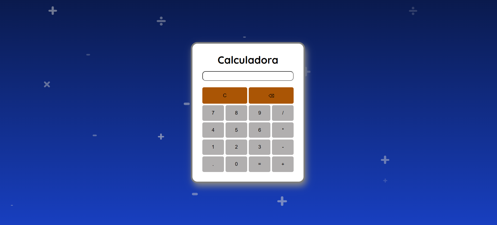

# 🧮 Calculadora Simples

Este é um projeto de **calculadora simples** feita com **HTML, CSS e JavaScript**. A interface é minimalista e responsiva, permitindo operações básicas de soma, subtração, multiplicação e divisão.

---

## 📌 Funcionalidades

✅ Interface intuitiva e responsiva  
✅ Operações básicas (+, -, *, /)  
✅ Botão de limpar (C)  
✅ Botão de apagar um número (⌫)  
✅ Design com símbolos matemáticos no fundo 

---

## 🚀 Tecnologias Utilizadas

- **HTML5** → Estrutura da calculadora  
- **CSS3** → Estilização e layout responsivo  
- **JavaScript** → Lógica da calculadora  

---

## 🎨 Captura de Tela

 <!-- Substitua por um print real do projeto -->

---

## 📂 Como Usar?

1️⃣ Baixe ou clone este repositório:  
```bash
git clone https://github.com/seu-usuario/calculadora-simples.git
